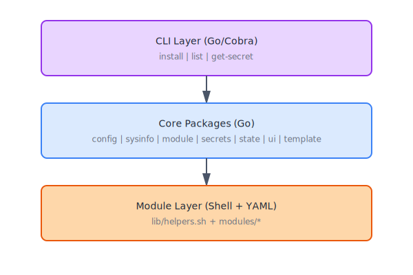

# Dotfiles Management System

> A robust, modular dotfiles manager built with Go and shell scripts

[](https://github.com/garygentry/dotfiles/actions/workflows/ci.yml)
[](https://go.dev/)
[](LICENSE)

## Features

- **🎯 Modular Architecture** - Self-contained modules with clear dependencies
- **🔄 Dependency Resolution** - Automatic topological sorting ensures correct execution order
- **♻️ Fully Idempotent** - Safe to run multiple times, only updates what changed
- **🖥️ Cross-Platform** - Works on macOS, Ubuntu, and Arch Linux
- **🔐 Secrets Management** - Integrated 1Password support for sensitive data
- **📝 Template Rendering** - Go templates for dynamic configuration files
- **✅ State Tracking** - Persistent state to track installations
- **💾 Automatic Backups** - Protects user modifications with timestamped backups
- **🎨 Beautiful CLI** - Colored output, spinners, and interactive prompts
- **🧪 Fully Tested** - Comprehensive unit and integration tests with CI

## Quick Start

### Installation

```bash
curl -sfL https://raw.githubusercontent.com/garygentry/dotfiles/main/bootstrap.sh | bash
```

This will:
1. Install Git and Go (if needed)
2. Clone the repository to `~/.dotfiles`
3. Build the CLI tool
4. Run the installation

### Manual Installation

```bash
# Clone repository
git clone https://github.com/garygentry/dotfiles.git ~/.dotfiles
cd ~/.dotfiles

# Build CLI
go build -o bin/dotfiles .

# Install modules
./bin/dotfiles install
```

### Usage

```bash
# List available modules
dotfiles list

# Install all modules (safe to run multiple times)
dotfiles install

# Install specific modules
dotfiles install git zsh neovim

# Use a profile
dotfiles install --profile minimal

# Preview changes without applying
dotfiles install --dry-run

# Run without prompts (use defaults)
dotfiles install --unattended

# Force reinstall (even if up-to-date)
dotfiles install --force

# Skip previously failed modules
dotfiles install --skip-failed

# Only update existing modules
dotfiles install --update-only

# Show prompts for auto-included dependencies (default: use defaults)
dotfiles install --prompt-dependencies

# Check status and see what needs updating
dotfiles status
```

> **🎯 Smart Prompts:** When installing modules, you'll only be prompted for configuration options for modules you explicitly selected. Auto-included dependencies use sensible defaults. Use `--prompt-dependencies` to configure dependencies interactively.

> **💡 Tip:** The system is fully idempotent - run `dotfiles install` as many times as you want! Only modules and files that actually changed will be updated. [Learn more →](docs/IDEMPOTENCE.md)

## Available Modules

| Module | Description | Dependencies |
|--------|-------------|--------------|
| **1password** | Install and configure 1Password CLI | - |
| **ssh** | Configure SSH keys and settings | 1password |
| **git** | Configure Git with SSH signing | ssh |
| **zsh** | Install Zsh with Zinit plugin manager | git |
| **neovim** | Install Neovim and symlink config | git |

[Creating modules guide →](docs/creating-modules.md)

## Configuration

### config.yml

Configure the system in `~/.dotfiles/config.yml`:

```yaml
profile: developer

secrets:
  provider: 1password
  account: my.1password.com

user:
  name: "Your Name"
  email: "your.email@example.com"
  github_user: "yourusername"

modules:
  ssh:
    key_type: ed25519
  git:
    default_branch: main
  zsh:
    theme: powerlevel10k
```

[Full documentation →](docs/README.md)

### Profiles

Profiles define module sets for different use cases:

**Developer Profile** (`profiles/developer.yml`):
```yaml
modules:
  - 1password
  - ssh
  - git
  - zsh
  - neovim
```

**Minimal Profile** (`profiles/minimal.yml`):
```yaml
modules:
  - git
  - zsh
```

[Full documentation →](docs/README.md)

## Architecture

The system uses a **hybrid architecture** where Go handles orchestration and shell scripts handle system operations. Go provides type-safe dependency resolution, structured state tracking, and rollback capabilities that would be fragile in pure shell. Shell scripts keep the actual installation logic readable and modifiable without recompilation.



**Key Features:**
- **Topological Dependency Resolution** - Kahn's algorithm ensures correct order
- **OS-Specific Logic** - Optional platform-specific scripts
- **Template Rendering** - Go templates with custom functions
- **Secrets Integration** - Seamless 1Password integration
- **State Tracking** - JSON-based state persistence

[Architecture documentation →](docs/architecture.md) · [Design rationale →](docs/design-rationale.md)

## Creating Modules

### Module Structure

```
modules/mymodule/
├── module.yml          # Metadata and configuration
├── install.sh          # Main installation logic
├── verify.sh           # Post-install verification (optional)
├── os/                 # OS-specific scripts (optional)
│   ├── macos.sh
│   ├── ubuntu.sh
│   └── arch.sh
└── files/              # Configuration files (optional)
    └── config.conf
```

### Example module.yml

```yaml
name: mymodule
description: Install and configure My Tool
version: 1.0.0
priority: 100
dependencies:
  - git
os: []  # Empty = all platforms
requires:
  - curl

files:
  - source: files/config.conf
    dest: ~/.config/mymodule/config.conf
    type: symlink

prompts:
  - key: theme
    message: "Which theme would you like?"
    type: choice
    options: [dark, light]
    default: dark
    show_when: explicit_install  # Optional: only show if module explicitly selected
```

### Example install.sh

```bash
#!/usr/bin/env bash
set -euo pipefail

log_info "Installing mymodule..."

# Install package using helper
pkg_install mymodule

# Create config directory
mkdir -p ~/.config/mymodule

# Get user's theme choice
THEME="${DOTFILES_PROMPT_THEME}"
log_info "Using theme: $THEME"

log_success "mymodule installed!"
```

[Complete module creation guide →](docs/creating-modules.md)

## Development

### Prerequisites

- Go 1.22+
- Bash 4.0+
- Docker (for integration tests)

### Building

```bash
# Build binary
make build

# Run unit tests
make test

# Run integration tests
make test-integration

# Run all tests
make test-all

# Lint code
make lint
```

### Project Structure

```
.
├── cmd/dotfiles/           # CLI commands
├── internal/               # Internal packages
│   ├── config/            # Configuration management
│   ├── module/            # Module system
│   ├── secrets/           # Secrets providers
│   ├── state/             # State tracking
│   ├── sysinfo/           # System detection
│   ├── template/          # Template rendering
│   └── ui/                # User interface
├── modules/               # Module definitions
│   ├── 1password/
│   ├── ssh/
│   ├── git/
│   ├── zsh/
│   └── neovim/
├── profiles/              # Profile definitions
├── lib/                   # Shell helper library
├── test/integration/      # Integration tests
├── docs/                  # Documentation
├── bootstrap.sh           # Bootstrap script
├── config.yml             # Main configuration
└── main.go               # Entry point
```

### Testing

**Unit Tests:**
```bash
go test ./...
```

**Integration Tests:**
```bash
# Ubuntu
make test-integration-ubuntu

# Arch Linux
make test-integration-arch

# Both
make test-integration
```

Integration tests run in Docker containers with full installations to verify end-to-end functionality.

### CI/CD

GitHub Actions CI runs on every push and PR:
- Unit tests with race detector
- Integration tests (Ubuntu + Arch)
- Docker layer caching for faster builds

[Full documentation →](docs/README.md)

## Documentation

- [Installation Guide](docs/installation.md)
- [Quick Start](docs/quick-start.md)
- [Architecture](docs/architecture.md) · [Design Rationale](docs/design-rationale.md)
- [Creating Modules](docs/creating-modules.md)
- [Idempotence](docs/IDEMPOTENCE.md)
- [CLI Reference](docs/cli-reference.md)
- [Rollback Guide](docs/rollback-guide.md)
- [Troubleshooting](docs/troubleshooting.md)

## FAQ

**Q: Why not use an existing dotfiles manager?**

A: This system provides unique features like integrated dependency resolution, secrets management, and a clean separation between orchestration (Go) and execution (shell).

**Q: Can I use this with my existing dotfiles?**

A: Yes! You can gradually migrate by creating modules that wrap your existing scripts.

**Q: How do I add my own modules?**

A: Follow the [Creating Modules](docs/creating-modules.md) guide. Modules are self-contained and easy to add.

**Q: What if I don't use 1Password?**

A: The secrets provider is optional. You can omit it or implement your own provider.

**Q: Can I run this in CI/CD?**

A: Yes! Use `--unattended` flag for non-interactive execution.

## Troubleshooting

### Installation Issues

```bash
# Run with verbose output
dotfiles install -v

# Check state files
cat ~/.dotfiles/.state/module-name.json

# Reset a module
rm ~/.dotfiles/.state/module-name.json
dotfiles install module-name
```

### Common Issues

**Q: Module fails to install**
```bash
# Check the state file for error details
cat ~/.dotfiles/.state/module-name.json

# Reinstall with verbose output
rm ~/.dotfiles/.state/module-name.json
dotfiles install module-name -v
```

**Q: Permission denied errors**
```bash
# Some operations require sudo
# The system will prompt for password when needed
```

[Full troubleshooting guide →](docs/troubleshooting.md)

## Contributing

Contributions are welcome! Please see [CONTRIBUTING.md](CONTRIBUTING.md) for guidelines.

### Quick Contribution Guide

1. Fork the repository
2. Create a feature branch (`git checkout -b feature/amazing-feature`)
3. Make your changes
4. Add tests if applicable
5. Run tests (`make test-all`)
6. Commit your changes (`git commit -m 'Add amazing feature'`)
7. Push to the branch (`git push origin feature/amazing-feature`)
8. Open a Pull Request

## License

This project is licensed under the MIT License - see the [LICENSE](LICENSE) file for details.

## Acknowledgments

- [Cobra](https://github.com/spf13/cobra) - CLI framework
- [1Password CLI](https://developer.1password.com/docs/cli/) - Secrets management
- [Zinit](https://github.com/zdharma-continuum/zinit) - Zsh plugin manager

## Author

**Gary Gentry**
- GitHub: [@garygentry](https://github.com/garygentry)
- Email: gary@garygentry.net

---

<p align="center">
  <sub>Built with ❤️ using Go and Shell</sub>
</p>
