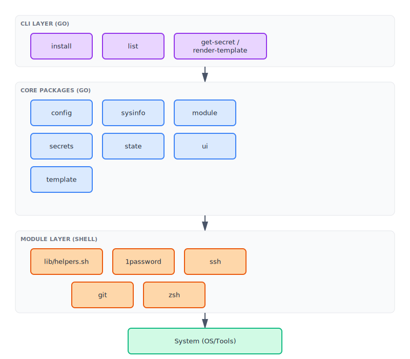
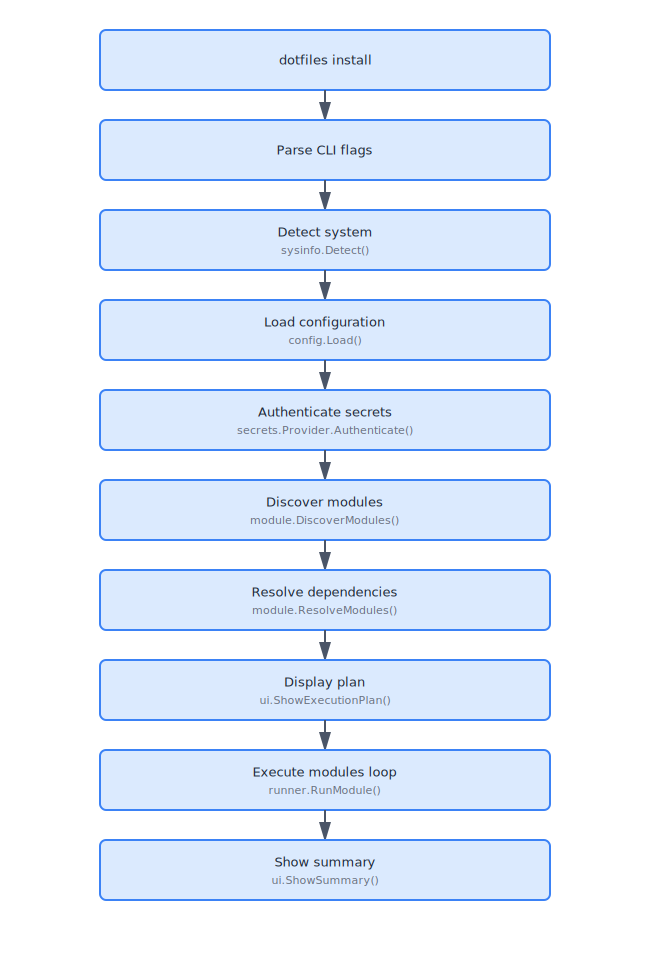

# Architecture

This document explains the design and architecture of the dotfiles management system.

## Design Philosophy

The system follows a **hybrid architecture** combining:
- **Go CLI** for orchestration, dependency resolution, and state management
- **Shell scripts** for actual system operations and tool installation

This separation provides:
- **Type safety and structure** from Go
- **Flexibility and portability** from shell scripts
- **Cross-platform compatibility** without requiring platform-specific Go code

For a deeper discussion of why Go was chosen over pure shell or other languages, and why the system builds from source rather than distributing pre-built binaries, see [Design Rationale](design-rationale.md).

## System Overview



## Core Components

### 1. CLI Layer (Cobra Framework)

**Location**: `cmd/dotfiles/`

The command-line interface built with [Cobra](https://github.com/spf13/cobra).

**Commands:**
- `install` - Install modules with dependency resolution
- `uninstall` - Uninstall modules and rollback changes
- `status` - Show installed modules and their state
- `list` - Show available modules
- `new` - Generate new module skeleton
- `get-secret` - Retrieve secrets (internal, called by shell scripts)
- `render-template` - Render Go templates (internal, called by shell scripts)

**Entry Point:** `main.go` → `cmd/dotfiles/root.go`

### 2. Config Package

**Location**: `internal/config/`

Handles configuration loading and management.

**Responsibilities:**
- Parse `config.yml` (main configuration file)
- Parse `profiles/*.yml` (profile definitions)
- Apply environment variable overrides
- Provide module-specific settings lookup

**Key Types:**
```go
type Config struct {
    Profile string
    Secrets SecretsConfig
    User    UserConfig
    Modules map[string]map[string]interface{}
}
```

### 3. Sysinfo Package

**Location**: `internal/sysinfo/`

Detects system information.

**Capabilities:**
- Operating system detection (parses `/etc/os-release` for Linux)
- Architecture detection (amd64, arm64)
- Package manager detection (brew, apt, pacman)
- Sudo availability check (non-blocking, 2s timeout)
- Interactive terminal detection
- Dotfiles directory resolution

**Key Type:**
```go
type SystemInfo struct {
    OS            string
    Arch          string
    PackageManager string
    HasSudo       bool
    IsInteractive bool
    Home          string
    DotfilesDir   string
}
```

### 4. Module Package

**Location**: `internal/module/`

Core module system implementation.

**Components:**

#### Discovery (`discovery.go`)
- Scans `modules/` directory
- Parses `module.yml` files
- Validates module schema
- Sorts by priority, then name

#### Schema (`schema.go`)
- Defines module structure
- YAML unmarshaling
- Validation rules

```go
type Module struct {
    Name         string
    Description  string
    Version      string
    Priority     int
    Dependencies []string
    OS           []string
    Requires     []string
    Files        []FileEntry
    Prompts      []Prompt
    Tags         []string
    Dir          string
}
```

#### Resolver (`resolver.go`)
- Dependency resolution using **Kahn's algorithm** (topological sort)
- Transitive dependency expansion (BFS)
- OS compatibility filtering
- Cycle detection with descriptive errors
- Deterministic ordering (priority → name)

**Algorithm:**
1. Build dependency graph
2. Expand transitive dependencies
3. Filter incompatible modules (OS mismatch)
4. Topological sort with priority ordering
5. Detect and report cycles

#### Runner (`runner.go`)
- Module execution orchestration
- Operation recording for rollback capability
- 8-phase lifecycle per module:
  1. Prompts (if interactive)
  2. Environment variable setup
  3. Template context preparation
  4. OS-specific script execution
  5. Install script execution (with operation tracking)
  6. File deployment (symlink/copy/template, with operation tracking)
  7. Verification script execution
  8. State recording (including operation history)
- Automatic rollback on failure with interactive prompt

**Interface Pattern:**
```go
type RunnerUI interface {
    StartSpinner(msg string) any
    StopSpinner(spinner any, success bool, msg string)
    // ... other UI methods
}
```

This interface decouples the module package from the UI package, preventing import cycles.

### 5. Secrets Package

**Location**: `internal/secrets/`

Pluggable secrets provider system.

**Interface:**
```go
type Provider interface {
    Name() string
    Available() bool
    Authenticate() error
    IsAuthenticated() bool
    GetSecret(ref string) (string, error)
}
```

**Implementations:**
- **1Password** (`onepassword.go`) - Integrates with `op` CLI
- **Noop** (`noop.go`) - No-op provider for systems without secrets

**1Password Provider:**
- Checks `op` CLI availability
- Authenticates via `op vault list`
- Retrieves secrets: `op read op://vault/item/field`
- 30-second timeout per operation
- Caches authentication status

### 6. Template Package

**Location**: `internal/template/`

Go template rendering with custom functions.

**Context:**
```go
type Context struct {
    User        map[string]string   // name, email, github_user
    OS          string              // Operating system
    Arch        string              // Architecture
    Home        string              // Home directory
    DotfilesDir string              // Repository path
    Module      map[string]any      // Module settings + prompts
    Secrets     map[string]string   // Retrieved secrets
    Env         map[string]string   // DOTFILES_* env vars
}
```

**Custom Functions:**
- `env` - Get environment variable
- `default` - First non-empty value
- `upper`, `lower` - Case conversion
- `contains` - Substring check
- `join` - Join slice with separator
- `trimSpace` - Whitespace trimming

### 7. State Package

**Location**: `internal/state/`

Persistent module state tracking with operation history for rollback.

**Storage:**
- Location: `~/.dotfiles/.state/`
- Format: JSON per module
- Filename: `<module-name>.json`

**ModuleState:**
```go
type ModuleState struct {
    Name        string
    Version     string
    Status      string      // "installed", "failed", "removed"
    InstalledAt time.Time
    UpdatedAt   time.Time
    OS          string
    Error       string
    Checksum    string
    Operations  []Operation // Operation history for rollback
}
```

**Operation:**
```go
type Operation struct {
    Type      string            // "file_deploy", "dir_create", "script_run", "package_install"
    Action    string            // "created", "modified", "backed_up", "symlinked", "executed"
    Path      string            // File path or package name
    Timestamp time.Time
    Metadata  map[string]string // Additional context (backup_path, source, type, etc.)
}
```

**Rollback Capability:**
- `CanRollback()` - Check if operations can be reversed
- `RollbackInstructions()` - Generate human-readable rollback plan
- `RecordOperation()` - Add operation to history with timestamp

**Operation Types:**
- **file_deploy**: File or symlink creation/modification
- **dir_create**: Directory creation
- **script_run**: Shell script execution (informational, not rolled back)
- **package_install**: Package manager installation (informational, not rolled back)

### 8. UI Package

**Location**: `internal/ui/`

Terminal user interface with colors and spinners.

**Features:**
- ANSI color output (Catppuccin Mocha palette)
- Animated spinners (braille characters)
- Interactive prompts (input, confirm, choice)
- Execution plan visualization
- TTY detection with graceful fallback

**Colors:**
```go
const (
    ColorRed    = "\033[38;5;210m"
    ColorGreen  = "\033[38;5;166m"
    ColorYellow = "\033[38;5;229m"
    ColorBlue   = "\033[38;5;147m"
    ColorGray   = "\033[38;5;245m"
    ColorReset  = "\033[0m"
)
```

### 9. Logging Package

**Location**: `internal/logging/`

Structured logging built on Go's `log/slog` (Go 1.21+).

**Logger Interface:**
```go
type Logger interface {
    Info(msg string, args ...any)
    Warn(msg string, args ...any)
    Error(msg string, args ...any)
    Debug(msg string, args ...any)
    Success(msg string, args ...any)
    With(args ...any) Logger
    WithGroup(name string) Logger
}
```

**Handlers:**
- **PrettyHandler**: Colorized human-readable output for terminals
  - `[INFO]`, `[WARN]`, `[ERROR]`, `[DEBUG]`, `[OK]` level prefixes
  - ANSI color coding (cyan, yellow, red, magenta, green)
  - Compact key=value attribute formatting
- **JSONHandler**: Machine-readable structured output
  - Standard `log/slog` JSON format
  - Useful for log aggregation and analysis

**Configuration:**
```go
type Config struct {
    Level     string    // "debug", "info", "warn", "error"
    Format    string    // "pretty", "json"
    Output    io.Writer // Defaults to os.Stderr
    AddSource bool      // Include source file/line
}
```

**Usage:**
```bash
# Enable JSON logging
dotfiles install git --log-json

# Enable debug logging
dotfiles install git --verbose
```

## Data Flow

### Installation Flow



### Module Execution Flow


### Shell Script Execution



## Dependency Resolution

### Algorithm: Kahn's Topological Sort



### Example

```yaml
# Module dependencies
1password: []
ssh: [1password]
git: [ssh]
zsh: [git]
neovim: [git]
```

**Execution order:**
1. 1password (priority 10, no deps)
2. ssh (priority 20, after 1password)
3. git (priority 30, after ssh)
4. zsh (priority 40, after git)
5. neovim (priority 50, after git)

Note: zsh and neovim could run in parallel since they only depend on git, but the system runs sequentially for simplicity.

## Module Lifecycle

```
Module Directory Structure:
modules/example/
├── module.yml      # Metadata
├── install.sh      # Main logic (required)
├── verify.sh       # Verification (optional)
├── os/             # OS-specific (optional)
│   ├── macos.sh
│   ├── ubuntu.sh
│   └── arch.sh
└── files/          # Config files (optional)
    └── config.conf
```

### Execution Phases

**1. Prompts**
- Only in interactive mode
- Answers stored as `DOTFILES_PROMPT_<KEY>`

**2. Environment Variables**
- System info: OS, arch, package manager
- Paths: home, dotfiles dir, module dir
- User config: name, email, github user
- Execution context: dry-run, verbose flags
- Prompt answers

**3. Template Context**
- Combines all data sources
- Available to template rendering

**4. OS Script**
- Runs only `os/${DOTFILES_OS}.sh` if it exists
- Platform-specific setup
- Has access to helpers

**5. Install Script**
- Runs `install.sh` (required)
- Main installation logic
- Has access to helpers

**6. File Deployment**
- Processes all `files` from module.yml
- Creates backups of existing files
- Symlinks, copies, or renders templates

**7. Verification**
- Runs `verify.sh` if it exists
- Post-install checks
- Can fail the module

**8. State Recording**
- Writes JSON to `.state/` directory
- Records success/failure, timestamps, errors

## Communication Patterns

### Go → Shell

**Environment Variables:**
```bash
export DOTFILES_OS="ubuntu"
export DOTFILES_ARCH="amd64"
export DOTFILES_VERBOSE="true"
# ... many more
```

**Wrapper Script:**
```bash
#!/usr/bin/env bash
set -euo pipefail
source lib/helpers.sh
source modules/example/install.sh
```

### Shell → Go

**Subprocess Calls:**
```bash
# In module script:
SECRET=$(get_secret "op://vault/item/field")

# Helper function calls Go CLI:
get_secret() {
    "$DOTFILES_BIN" get-secret --ref "$1"
}
```

```bash
# In module script:
render_template "config.tmpl" ~/.config/app/config

# Helper function calls Go CLI:
render_template() {
    "$DOTFILES_BIN" render-template --src "$1" --dest "$2"
}
```

## Design Patterns

### 1. Interface Decoupling

**Problem:** Module package needed UI functionality but importing UI caused cycles.

**Solution:** `RunnerUI` interface in module package:
```go
// In module package
type RunnerUI interface {
    StartSpinner(msg string) any
    StopSpinner(spinner any, success bool, msg string)
}

// UI package implements it
func (u *UI) StartSpinner(msg string) any {
    // Implementation
}
```

### 2. Pluggable Providers

**Secrets Provider:**
```go
type Provider interface {
    Name() string
    Available() bool
    Authenticate() error
    IsAuthenticated() bool
    GetSecret(ref string) (string, error)
}
```

Easy to add new providers (AWS Secrets Manager, HashiCorp Vault, etc.)

### 3. Phased Execution

Module execution is broken into discrete phases:
- Clear separation of concerns
- Easy to add new phases
- Consistent error handling per phase

### 4. Composition over Inheritance

Modules are composed of:
- Metadata (module.yml)
- Scripts (install.sh, os/*.sh, verify.sh)
- Files (files/*)

No base class or inheritance hierarchy.

## Performance Considerations

### Parallel Execution

Currently sequential, but architecture supports parallel execution:
- Dependency graph enables parallelism
- Modules at same dependency level could run concurrently
- State tracking handles concurrent writes

### Caching

- **Module Discovery:** Cached during execution
- **System Info:** Detected once at startup
- **Authentication:** 1Password auth cached for session
- **Docker Layer Caching:** CI uses GitHub Actions cache

### Minimal Dependencies

- Small Go binary (~5-10MB)
- No runtime dependencies except bash
- Modules pull in their own dependencies

## Security Model

### Trusted Boundaries

**Trusted:**
- Environment variables
- CLI flags
- config.yml (user's own file)
- module.yml files (repo content)

**Untrusted:**
- Network downloads (modules should verify checksums)
- External secrets (validated by provider)

### Secrets Handling

- Never logged or displayed
- Passed via environment or temp files
- Provider authentication required
- 30-second timeouts prevent hanging

### File Operations

- Automatic backups before overwrite
- Permissions preserved on copy
- Symlinks created safely
- No arbitrary file writes (destination in module.yml)

## Testing Strategy

### Unit Tests

- Located in `internal/*/` with `*_test.go`
- Test individual packages in isolation
- Run with `go test ./...`

### Integration Tests

- Docker-based for Ubuntu and Arch
- Full installation in clean container
- Verify all modules work end-to-end
- Run with `make test-integration`

### CI Pipeline

```yaml
Unit Tests (always)
    ↓
Integration Tests (matrix: ubuntu, arch)
    ↓
All green → Ready to merge
```

## Extensibility Points

### Add New Command

1. Create `cmd/dotfiles/newcommand.go`
2. Implement Cobra command
3. Add to root command

### Add New Module

1. Create `modules/newmodule/`
2. Add `module.yml`
3. Add `install.sh`
4. Optionally add OS scripts, files

### Add New Secrets Provider

1. Implement `secrets.Provider` interface
2. Add provider factory in config
3. Update config.yml schema

### Add Template Function

1. Add function to `template/render.go`
2. Register in `template.FuncMap`

## Future Enhancements

Potential improvements:

1. **Parallel Module Execution** - Run independent modules concurrently
2. **Module Marketplace** - Discover and install community modules
3. **Rollback Support** - Undo failed installations
4. **Diff Preview** - Show file changes before applying
5. **Remote Profiles** - Load profiles from URLs
6. **Plugin System** - Extend CLI with plugins
7. **GUI Interface** - Web or desktop UI for management

## References

- [Cobra CLI Framework](https://github.com/spf13/cobra)
- [Go Templates](https://pkg.go.dev/text/template)
- [Kahn's Algorithm](https://en.wikipedia.org/wiki/Topological_sorting#Kahn's_algorithm)
- [1Password CLI](https://developer.1password.com/docs/cli/)
